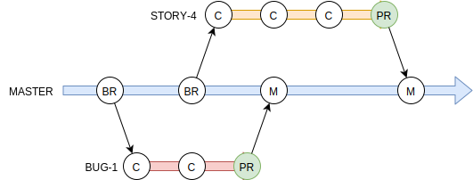

# Development Strategy
The purpose of this document is to capture the basic rules and guidelines to follow when working in this repository.  It is expected everyone follows the rules, however, the guidelines are flexible and people should make use of common sense when deciding when to follow or break away from the guideline.

## Git Strategy
Source code management is a vital component of software development.  A disorganized and chaotic repository will ultimately lead to a number of bugs being introduced, reintroducing old bugs, wasted effort by the development team, and ultimately a low quality product.

The strategy below is intended to be a set of **rules** to be followed by everyone.

This project follows the *Feature Branch Workflow* as described in [Atlassian Bitbucket](https://www.atlassian.com/git/tutorials/comparing-workflows/feature-branch-workflow), I don't know where the original idea came from but Bitbucket has a very nice overview of it.  The general idea is the ``master`` branch ***always*** contains the latest production code and is used for deployment.  ***All*** work done in separate branches pulled off of ``master`` and then merged back in with a pull request.  This flow is shown below.

The basic 

### Branch Naming Conventions
The project uses [Taiga](https://taiga.io/) to manage sprints and can be found [here](https://tree.taiga.io/project/bart-c137-s2019-ftpclient/timeline) if you're interested.  Taiga uses stories, tasks, and issues to manage work.  Issues are also broken down into bugs, questions, and enhancements.  All of these are work items and are identified by a simple incrementing number.

## Coding Standards
For the most part the coding standards are rules.